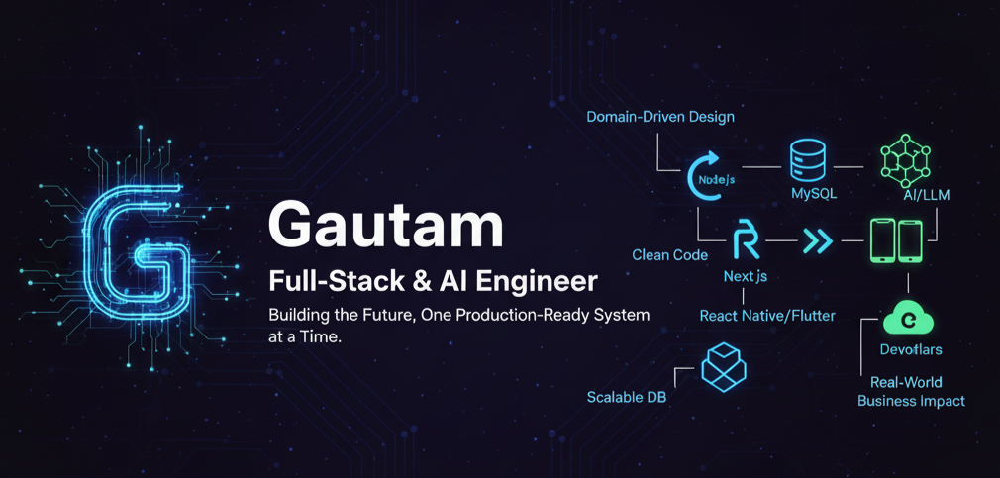

<!-- Banner -->

  

<h1 align="center">Hi, I'm Gautam 👋</h1>
<h3 align="center">Full Stack Developer | MERN & MEAN | Flutter | RAG Engineer | Prompt Engineer</h3>

---

### 🚀 About Me
- 🧠 **5+ years** of experience building scalable applications
- 🏗️ Specialized in **CRM systems, DDD architecture, & clean backend design**
- 📱 Also build **Flutter UI components & trading chart tools**
- 🤖 Working actively with **RAG + LLM + Prompt Engineering**
- 🎯 Always learning and exploring new tech stacks & architectures

---

### 🛠️ Tech Stack & Tools

#### **Frontend**
`React` · `Next.js` · `Flutter` · `Tailwind` · `Material UI`

#### **Backend**
`Node.js` · `Express.js` · `NestJS` · `Laravel` · `PHP`

#### **Databases**
`MySQL` · `MongoDB` · `PostgreSQL`

#### **AI / RAG / LLM**
`LangChain` · `Vector DBs` · `Prompt Engineering`

#### **DevOps & Tools**
`Docker` · `Linux` · `Nginx` · `Git` · `Postman` · `Cloudflare`

---

### ⭐ Featured Projects

| Project | Description | Tech |
|--------|-------------|------|
| **Multi-Tenant CRM System** | DDD based CRM with Accounts, Sites & AED mgmt + automated CRON workflows | Node.js · MySQL · Express |
| **Trading Flutter Widgets** | Custom chart widgets optimized for mobile trading dashboards | Flutter · Dart |
| **RAG Q/A Engine** | Private document based question-answer search system | LangChain · Vector DB · LLM |

> Want me to document these & add visuals? I can do that next ✅

---

### 📊 GitHub Stats

  
  

---

### 🌐 Connect With Me

---

### ✨ Quote I Live By
> _"Code is not just logic — it is expression, craft, and art."_ 🎨

