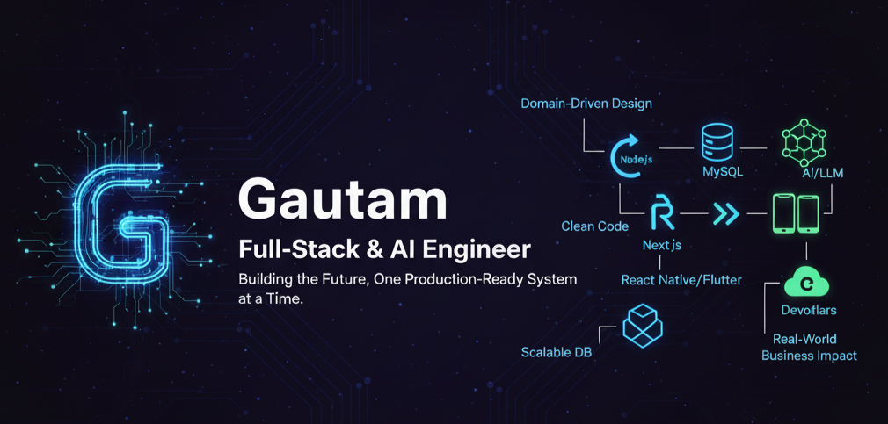

<!-- Banner -->

  

<h1 align="center">Hi, I'm Gautam 👋</h1>
<h3 align="center">Full Stack Developer | React Native & Flutter | Node.js | RAG & LLM Engineer</h3>

  

---

### 🚀 About Me
- 🧠 **5+ Years Experience** building scalable full-stack applications  
- 🏗 Focused on **CRM systems**, **Domain-Driven Architecture**, & clean backend design  
- 📱 Skilled in **React Native & Flutter** for cross-platform UI development  
- 🤖 Building **RAG + LLM** based retrieval & smart knowledge systems  
- 🎯 Passionate about performance-driven, elegant, maintainable systems  

---

### 🛠️ Tech Stack

| Domain | Technologies |
|-------|--------------|
| **Frontend** | React • Next.js • React Native • Flutter • Tailwind • Material UI |
| **Backend** | Node.js • Express.js • NestJS • Laravel • PHP |
| **Databases** | MySQL • MongoDB • PostgreSQL |
| **AI / LLM / RAG** | LangChain • Vector Databases • Prompt Engineering |
| **DevOps & Tools** | Docker • Linux • Git • Postman • Cloudflare • Nginx |

---

### ⭐ Highlight Projects

| Project | Description | Tech Stack |
|--------|-------------|-----------|
| **Multi-Tenant CRM System** | Full CRM with DDD architecture, automated checklists, scheduled CRON workflows | Node.js • MySQL • Express |
| **Trading / Finance UI Widgets** | High-performance chart widgets optimized for trading dashboards | Flutter • Dart |
| **RAG Knowledge QA System** | Private-document Q/A search engine with vector embeddings | LangChain • LLM • Vector DB |

---

### 📊 GitHub Stats & Activity

  
  

  

<!-- Contribution Snake -->

  

---

### 🌐 Connect With Me

---

### ✨ Quote I Live By  
> _"Code is not just logic — it is expression, craft, and art."_ 🎨
